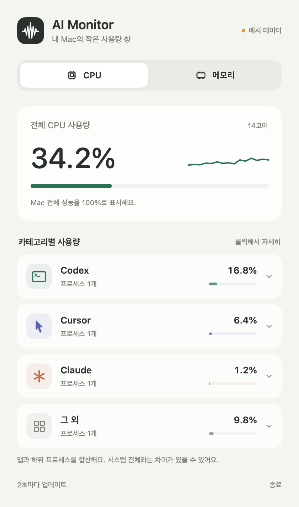
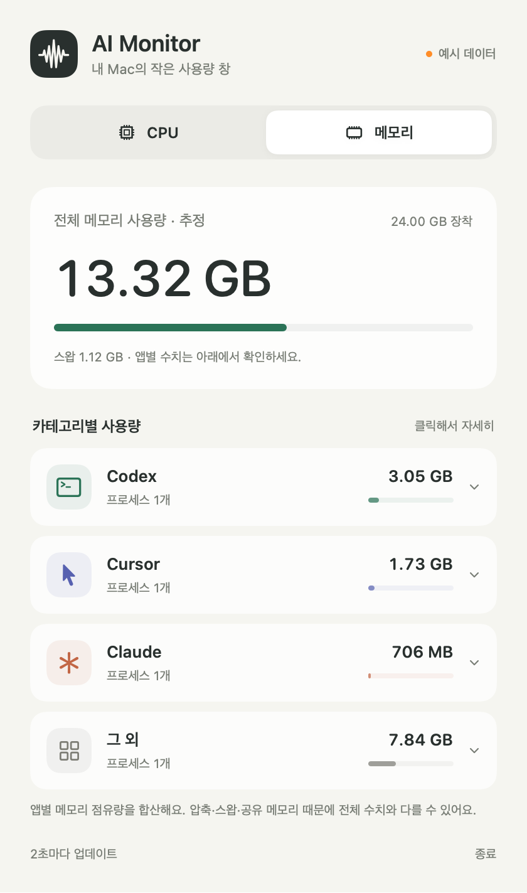

# AI Monitor

Mac에서 AI 도구가 사용하는 CPU와 메모리를 한눈에 확인하는 작은 메뉴 막대 앱입니다.

 

미리보기 이미지는 예시 데이터이며 실제 사용량이 아닙니다.

- CPU / 메모리 탭
- Codex · Cursor · Claude · 그 외 카테고리별 합산
- 카테고리를 클릭하면 프로세스 이름, PID, 개별 사용량 표시
- 2초 간격 갱신과 최근 1분 CPU 그래프
- 앱을 열면 첫 창 표시, 창을 닫아도 메뉴 막대에서 계속 확인
- 네트워크 요청이나 사용량 저장 없음

## 실행

macOS 14 이상과 Swift 6 이상이 필요합니다. 외부 패키지는 사용하지 않습니다.

```sh
bash scripts/build-app.sh
open "dist/AI Monitor.app"
```

로컬 개발용 서명으로 빌드합니다. 다른 Mac에 배포할 때는 Developer ID 서명과 notarization이 별도로 필요합니다.

```sh
bash scripts/test.sh
```

## 수치 읽는 법

**CPU:** Mach 시간 카운터를 나노초로 변환한 뒤, 두 측정 사이 프로세스 CPU 시간 차이를 경과 시간과 논리 코어 수로 나눕니다. Mac 전체를 100%로 표시합니다. 활성 상태 보기의 프로세스별 CPU는 코어 하나를 100%로 표시하므로 숫자가 다릅니다. 첫 측정이나 새 프로세스는 다음 측정까지 `—`로 표시합니다.

**메모리:** 프로세스의 `ri_phys_footprint`를 합산합니다. 전체 사용량은 macOS VM 통계로 계산한 추정치이며 활성 상태 보기와 정확히 일치하지 않을 수 있습니다. 공유·압축·스왑 메모리와 읽기 권한 차이 때문에 카테고리 합계는 시스템 전체 수치와 일치하지 않으며 장착 RAM보다 클 수도 있습니다. 막대는 장착 RAM 대비 비율이며 100%에서 표시를 제한합니다. macOS의 메모리 표기 관례에 따라 1 GB = 1,024³ 바이트로 표시합니다.

**분류:** 실행 파일 이름과 정확한 `.app` 경로로 AI 도구를 찾고, 인식되지 않은 자식 프로세스는 가장 가까운 AI 도구 부모를 따릅니다. 다른 AI 도구로 직접 인식된 자식은 자기 카테고리에 들어갑니다. 그 외에는 다른 앱, 시스템 프로세스와 AI Monitor 자체가 포함됩니다. 부모가 종료되어 연결이 끊어진 프로세스, 별도로 실행한 공용 서버, 브라우저 안의 AI 서비스는 정확히 연결하지 못할 수 있습니다.

**읽기 제한:** 권한이 없거나 측정 중 종료된 프로세스는 읽기 불가로 표시하고 합계에서 제외합니다. 전체 CPU는 시스템 통계에서 별도로 읽습니다. 관리자 권한을 요구하거나 보안 설정을 변경하지 않습니다.

## 구조

- `SystemProbe`: macOS libproc / Mach 통계 수집
- `ResourceCore`: 프로세스 분류와 사용량 계산
- `AIResourceMonitor`: SwiftUI 화면과 메뉴 막대
- `ResourceCoreTests`: 분류, 합산, PID 재사용, 읽기 실패, 실제 시스템 측정, POSIX 시계와 CPU 시간 단위 교차 검증

## 참고

- [Apple MenuBarExtra](https://developer.apple.com/documentation/swiftui/menubarextra)
- [Apple resource.h](https://github.com/apple/darwin-xnu/blob/main/bsd/sys/resource.h)

현재는 로컬 개발용 첫 버전입니다. libproc 인터페이스는 macOS 버전에 따라 바뀔 수 있습니다.
